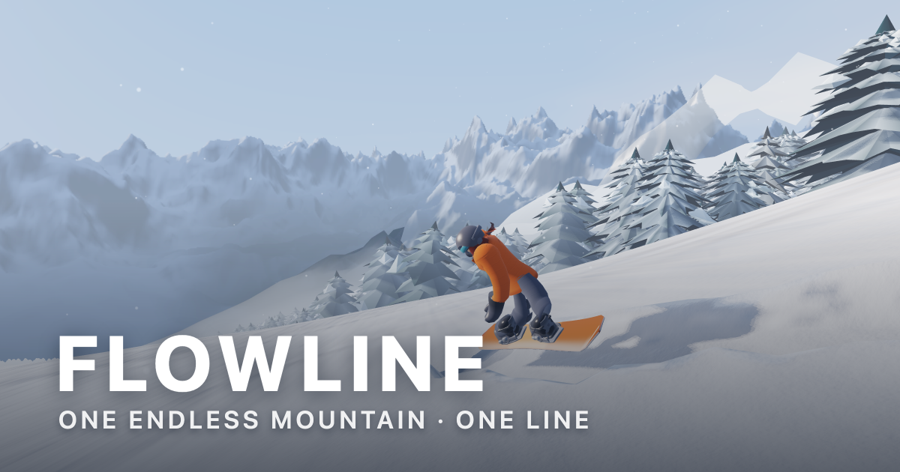

<p align="center">
  
</p>

<h3 align="center">One endless sunlit mountain.<br>Carve clean lines, build flow, ride it forever — together.</h3>

<p align="center">
  <a href="https://flowline.games.bu.app"><b>▶&nbsp; Play now</b></a>
</p>

---

### Flips, and the top of the run

[](media/flip-and-opening-run.mp4)

### Deformable snow, up close

[](media/deformable-snow.mp4)

<sub>Click either image to play the clip.</sub>

---

### Controls

| | |
|---|---|
| `A` `D` &nbsp;or&nbsp; `←` `→` | Carve |
| `S` &nbsp;or&nbsp; `↓` | Tuck — go faster |
| `W` `Space` &nbsp;or&nbsp; `↑` | Pop — jump |
| `Shift` | Grab |
| `Q` `E` | Back flip · front flip |
| `T` | Timer and splits |
| `R` | Restart |
| `P` `Esc` | Pause |
| `M` | Music |
| `?` | Help |

Phones and tablets get on-screen controls automatically. Flips are keyboard only, and landing one badly hurts.

### Run it yourself

Python 3 is the only requirement — no bundler, no npm, no dependencies.

```sh
git clone https://github.com/Alezander9/Flowline.git
cd Flowline
python3 build.py
```

That writes `flowline.html`: one self-contained file of about 750 KB, no assets folder and no server. Open it in any browser.

The terrain, trees, snow, sky and music are all generated in code from a seed, so everyone riding the same seed rides the same mountain.

### Multiplayer

The client (`src/net.js`) expects a websocket relay at `wss://<host>/ws/<room>`. With one, riders share a mountain and can see each other's lines. Without one, the game runs single player.
